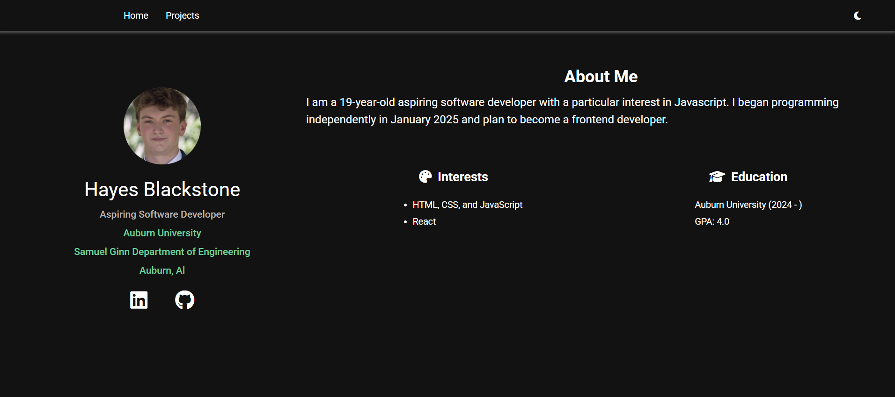

# Personal Website

A personal website that includes a short bio, an about-me paragraph, and some additional information.

## 🌐 Live Demo

[Click here to view the live site](https://hgb0043.github.io/personal-website/code/code/index.html)

## 📸 Home Page Screenshot (As of May 16 2025)

## 🛠️ Features

- Clean, responsive layout
- Multi-page navigation
- Dark mode vs. light mode custimization
- Compatible Display (phone, tablet, computer)

## 🚀 Technologies Used

- HTML5
- CSS3 (Flexbox, Grid)
- JavaScript (Vanilla)
- Git & GitHub

## 📁 Folder Structure

personal-website/
|-- index.html
|-- projects.html
|-- images/
|   |-- circular-portrait.jpg
|   |-- personal-website-inspiration.avif
|-- scripts/
|   |-- script.js
|   |-- projects.js
|-- styles/
    |-- styles.css
    |-- projects.css

